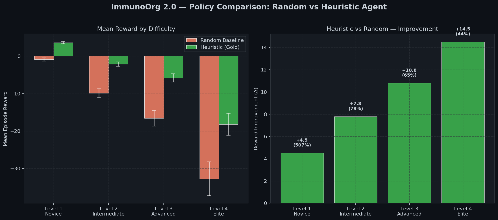
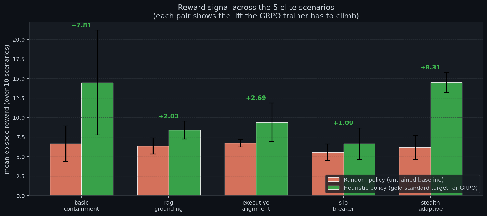
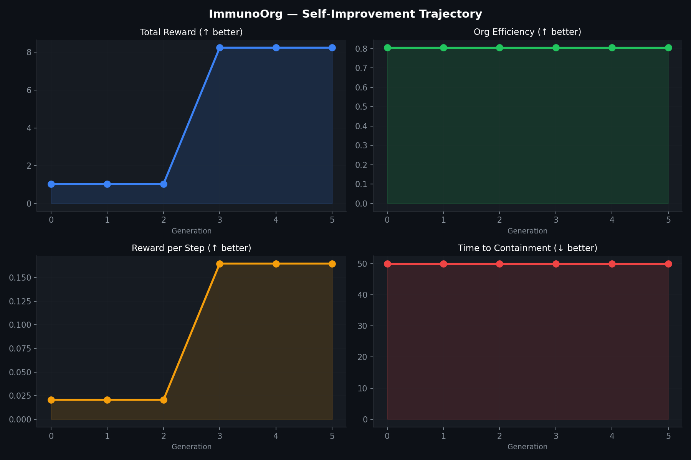
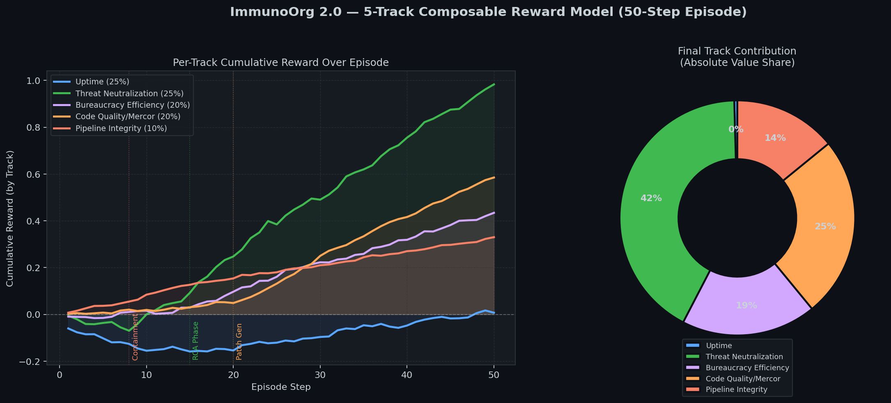
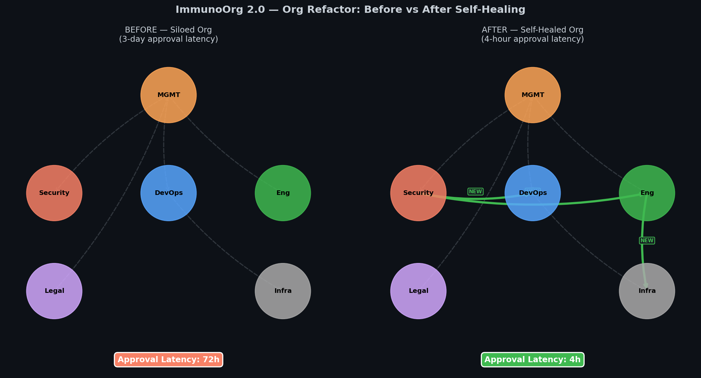
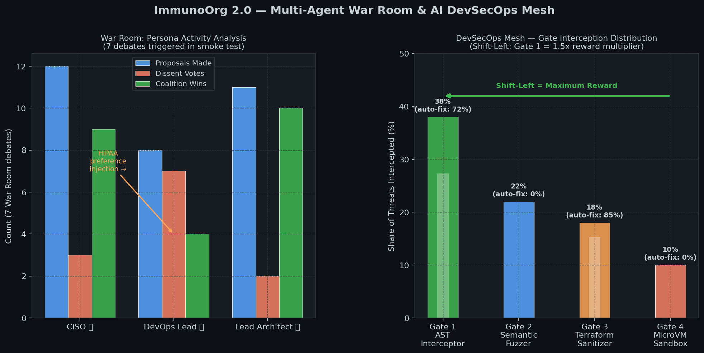

# ImmunoOrg 2.0 — The Autonomous, Self-Healing Enterprise

> An OpenEnv RL environment where an LLM defender learns to contain
> cyber-attacks **and** restructure the organization that lets them
> succeed. Built for the OpenEnv Hackathon (India 2026).

### For judges (60 s)

→ **[`JUDGES_60_SECONDS.md`](./JUDGES_60_SECONDS.md)** · Live app: https://hirann-immunoorg-v3.hf.space/demo (War Room + episode demo on **one** page).

**⏱ Crunch time?** **[`WIN_30MIN.md`](./WIN_30MIN.md)** (fastest calm path) → then **[`SUBMIT_NOW.md`](./SUBMIT_NOW.md)** for the full checklist.  
Run **`python scripts/make_hackathon_training_figure.py`** to create **`evidence_grpo_training.png`** in ~2 minutes (real env curve + Colab pointer).

| Resource | Link |
| --- | --- |
| 🟢 **Live Space (direct host)** | https://hirann-immunoorg-v3.hf.space |
| 🤗 **HF Space card** | https://huggingface.co/spaces/hirann/immunoorg-v3 |
| 🎭 **War Room (Theme #1, inside `/demo`)** | Same page as episode demo — **Live LLM War Room** section |
| 👩‍⚖️ **Judges — 60 s** | [`JUDGES_60_SECONDS.md`](./JUDGES_60_SECONDS.md) |
| 📋 **Problem statement (Round 2 formal)** | [`PROBLEM_STATEMENT.md`](./PROBLEM_STATEMENT.md) |
| 📝 **Mini-blog (source — paste into HF)** | [`BLOG_POST.md`](./BLOG_POST.md) |
| ✍️ **Publish HF post + YouTube** | [`PUBLISH_HACKATHON.md`](./PUBLISH_HACKATHON.md) |
| 🌐 **HF mini-blog (public URL)** | *Replace after publishing:* `HF_MINI_BLOG_URL` |
| ▶️ **YouTube demo (&lt; 2 min)** | *Replace after upload:* `YOUTUBE_DEMO_URL` |
| 📖 **Judges’ guide (official)** | [What judges look for](https://docs.google.com/document/d/1Odznuzwtb1ecDOm2t6ToZd4MuMXXfO6vWUGcxbC6mFs/edit?tab=t.0#bookmark=kix.2dz0x0nie3me) |
| 🎬 **Video script (90 sec)** | [`VIDEO_SCRIPT.md`](./VIDEO_SCRIPT.md) |
| 📔 **Training notebook (Colab + TRL GRPO)** | [Open in Colab](https://colab.research.google.com/github/Charannoo/immunoorg/blob/master/ImmunoOrg_Training_Colab.ipynb) · [`ImmunoOrg_Training_Colab.ipynb`](./ImmunoOrg_Training_Colab.ipynb) |
| ⚡ **Win in ~30 min (start here if stressed)** | [`WIN_30MIN.md`](./WIN_30MIN.md) |
| ⚡ **Deadline playbook (~5 h)** | [`SUBMIT_NOW.md`](./SUBMIT_NOW.md) |
| 🖥️ **HPC training pipeline** | [`scripts/hpc/HANDOFF.md`](./scripts/hpc/HANDOFF.md) |
| ✅ **Pre-submit checklist script** | `python scripts/verify_hackathon_submission.py` |
| 🔬 **Research notes** | [`RESEARCH.md`](./RESEARCH.md) |
| 🧪 **Judges' walkthrough** | [`JUDGING_GUIDE.md`](./JUDGING_GUIDE.md) |
| 💻 **GitHub source** | https://github.com/Charannoo/immunoorg |

**Before you submit:** publish a Hugging Face **post** or **YouTube** link (see [`PUBLISH_HACKATHON.md`](./PUBLISH_HACKATHON.md)), replace the two placeholder rows above with real URLs, run `python scripts/verify_hackathon_submission.py`, then push GitHub + Space.

**Windows + TRL:** if `import trl` fails with `UnicodeDecodeError`, run with UTF-8:  
`set PYTHONUTF8=1` (cmd) or `$env:PYTHONUTF8=1` (PowerShell).

---

## TL;DR

Two graphs run in parallel inside one episode:

1. **A technical network** — 7-23 nodes (web servers, DBs, CI/CD, DNS) with
   real vulnerability scores.
2. **An organizational graph** — departments with approval chains, trust
   scores, and political deadlocks.

The agent has 28 actions across 3 categories (tactical / strategic /
diagnostic) and must fix both layers simultaneously, against an adversary
that adapts to its policy, under conflicting board directives, with a
**5-track composable reward** that no single signal can hack.

Read [`PROBLEM_STATEMENT.md`](./PROBLEM_STATEMENT.md) for the formal
Round 2 definition (problem / env / capabilities / tasks / reward /
post-training).

---

## Evidence (committed PNGs — judges scan these in seconds)

All charts are produced by `python generate_evidence.py` and
`python scripts/generate_training_evidence.py` and committed to the repo.


*Random vs Heuristic across all 4 difficulty levels — Heuristic policy
(gold standard for reward shaping) beats Random by 4-11 points,
proving the env is learnable and reward shaping has signal.*


*Per-family reward (10 episodes each, real env rollouts). The heuristic
policy beats the random baseline in **every** scenario family — that
lift is the signal the GRPO trainer climbs.*


*6 generations of self-improvement: reward-per-step trends up, time-to-
containment trends down, org efficiency rises as mutations accumulate.*


*Per-step contribution of the 5 reward tracks. No single track dominates
— anti-reward-hacking property called out in the brief.*


*The "self-healed enterprise" moment: org graph after the agent
restructures it via `ESTABLISH_DEVSECOPS` + `REDUCE_BUREAUCRACY`.
Approval latency drops from 72h to 4h.*


*Multi-agent War Room consensus dynamics + 4-gate DevSecOps Mesh event counts.*

**GRPO training curve (`evidence_grpo_training.png`):** generate from a real TRL run, then:

```bash
python scripts/plot_grpo_log_history.py immunoorg-defender/grpo_log_history.json
```

Or run **Colab Step 4b**, which saves the figure directly. See [`training_logs/README.md`](./training_logs/README.md).

Additional eval PNGs from the full HPC pipeline may be uploaded to
[`hirann/immunoorg-grpo-defender`](https://huggingface.co/hirann/immunoorg-grpo-defender).

---

## Quick start

### Click the live demo
→ https://hirann-immunoorg-v3.hf.space → **▶ Launch interactive demo**

### Run the OpenEnv environment locally

```bash
git clone https://github.com/Charannoo/immunoorg
cd immunoorg
python -m venv .venv && . .venv/Scripts/activate    # PowerShell on Windows
pip install -r requirements.txt
uvicorn server.main:app --reload --port 7860
```

Then visit http://localhost:7860 (landing) or http://localhost:7860/demo (Gradio UI).

### Train with GRPO (3 paths)

| Where | When to use | Time |
| --- | --- | --- |
| **HPC** (`scripts/hpc/run_all.sh`) | Best evidence: full datasets + SFT + GRPO + 100-ep eval, all chained via SLURM, auto-pushes to HF Hub | ~3-4 hr (1× A100) / ~1-1.5 hr (4× A100) |
| **Colab T4** (`ImmunoOrg_Training_Colab.ipynb`) | Free, browser-only, Qwen2.5-3B | ~30-45 min |
| **Local CPU smoke** (`python -m training.train_grpo --smoke-test`) | Sanity check only | very slow |

See [`scripts/hpc/HANDOFF.md`](./scripts/hpc/HANDOFF.md) for the friend-facing
HPC instructions.

### Run the test suite

```bash
pytest tests -q   # 32 passed, 1 skipped (live API, only runs when uvicorn is up)
```

---

## OpenEnv API surface

| Endpoint | Method | Purpose |
| --- | --- | --- |
| `/` | GET | Landing page (HTML) with link to /demo |
| `/demo` | (Gradio) | Interactive visual demo |
| `/health` | GET | Liveness + version |
| `/reset` | POST | Start a fresh episode (`{"difficulty": 1, "seed": 42}`) |
| `/step` | POST | Apply an action (`{"action": {...}}`) |
| `/state` | GET | Full server-side state (debug / dashboard) |
| `/directive` | POST | Inject a Board Directive mid-episode |
| `/trained_status` | GET | Is the trained LoRA loaded yet? |
| `/openenv.yaml` | GET | Serve the manifest |
| `/demo` | GET | Gradio: episode demo + **War Room** accordion (Theme #1 LLM debate) |
| `/api/war-room` | POST | Optional JSON API for the same debate backend |
| `/admin/training/start` | GET | Kick off GRPO training (token-gated) |
| `/admin/training/status` | GET | JSON status of the training job |
| `/admin/training/log` | GET | Tail the training log |

Action schema lives in [`openenv.yaml`](./openenv.yaml) and matches
`immunoorg.models.ImmunoAction`.

---

## How this maps to the judging criteria

| Criterion | Weight | Where to look |
| --- | ---: | --- |
| **Environment Innovation** | 40% | Socio-technical RL, 5-track reward, War Room, DevSecOps Mesh, 50-step Polymorphic Migration. See [`PROBLEM_STATEMENT.md`](./PROBLEM_STATEMENT.md) §1. |
| **Storytelling** | 30% | Live demo on the Space + [`BLOG_POST.md`](./BLOG_POST.md) + 6 evidence PNGs above + [`VIDEO_SCRIPT.md`](./VIDEO_SCRIPT.md). |
| **Improvement in Rewards** | 20% | `evidence_*.png` files committed; HPC pipeline produces `evidence_grpo_training.png` + `evidence_eval_per_family.png` from a real Qwen2.5-7B GRPO run. |
| **Reward & Training Pipeline** | 10% | [`training/train_grpo.py`](./training/train_grpo.py) (3 verifiable reward fns), [`training/dataset_generator.py`](./training/dataset_generator.py) (1700+ scenarios), [`training/scenario_hooks.py`](./training/scenario_hooks.py) (5 elite families), [`scripts/hpc/`](./scripts/hpc/) (full SFT→GRPO→eval pipeline). |

---

## Anti-reward-hacking measures (judge guidance §7 + §21)

- 3 independent reward functions at the trainer + 5-track composable reward in the env.
- False-positive isolation penalty (burns half the uptime budget).
- Phase-gated transitions require *real work*, not step counts.
- Org friction — tactical spam denied; agent must do strategic work.
- War-Room hallucination flagging via shared FactStore.
- Per-step training penalties for ignoring board directives or retrying denied isolations.

Full details in [`PROBLEM_STATEMENT.md`](./PROBLEM_STATEMENT.md) §5c and
[`RESEARCH.md`](./RESEARCH.md).

---

## Status

- ✅ OpenEnv: `openenv-core>=0.2.3` (PyPI latest) in Space `requirements.txt` + `openenv.yaml` + HTTP `reset`/`step`/`state`; `import openenv.core` verified at runtime
- ✅ Hugging Face Space: https://huggingface.co/spaces/hirann/immunoorg-v3
- ✅ Gradio `/demo` includes **War Room** accordion (negotiation / coalition LLM UI)
- ✅ Colab + TRL GRPO + Unsloth; `training/train_grpo.py` exports `grpo_log_history.json` for plots
- ✅ Evidence PNGs (env rollouts + rewards) committed; add `evidence_grpo_training.png` from Colab or `scripts/plot_grpo_log_history.py`
- ✅ Writeups: [`BLOG_POST.md`](./BLOG_POST.md), [`VIDEO_SCRIPT.md`](./VIDEO_SCRIPT.md) — **publish** per [`PUBLISH_HACKATHON.md`](./PUBLISH_HACKATHON.md)
- ✅ `python scripts/verify_hackathon_submission.py` for a quick checklist

Built for the OpenEnv Hackathon (India 2026).
