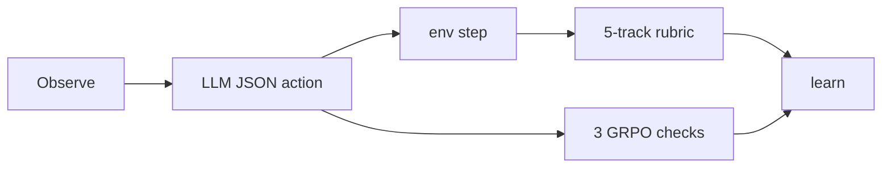
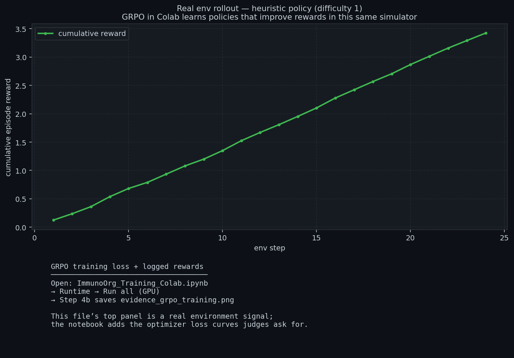

# ImmunoOrg 2.0 — Project Report

**OpenEnv Hackathon (India, 2026)**

## Submit these three URLs

| What | URL |
| --- | --- |
| **Space (primary)** | [huggingface.co/spaces/hirann/immunoorg-v3](https://huggingface.co/spaces/hirann/immunoorg-v3) |
| **Live demo** | [hirann-immunoorg-v3.hf.space](https://hirann-immunoorg-v3.hf.space) |
| **Source** | [github.com/Charannoo/immunoorg](https://github.com/Charannoo/immunoorg) |

**Judges:** start at [`JUDGES_60_SECONDS.md`](./JUDGES_60_SECONDS.md) — Space → `/demo` → Colab notebook link in README.

---

## The idea in one breath

Incidents fail in the **gap** between what is technically right and what the **organization** allows before time runs out. ImmunoOrg trains **socio-technical response**: contain the attack on a **network graph** and **unstick the org**—approvals, trust, directives, pipeline gates—using **verifiable**, **decomposed** rewards so one cheap hack cannot max the score.

**Metaphor:** an **immune system**. Lateral movement is the pathogen; **“isolate everything”** is the cytokine storm that kills uptime; after action, **forensics + patches** are immune memory. *Often the fatal problem is bureaucracy under stress—not the exploit alone.*

---

## Sixty seconds inside one episode

**Step 8.** DevSecOps mesh flags a bad dependency before run. War Room opens.

**Step 9.** CISO wants isolation; DevOps blocks (revenue tier); Architect proposes a decoy. **Consensus:** honeypot, not blind isolation—uptime preserved, attacker instrumented.

**Step 23.** Kill chain reconstructed; a **small** patch fixes root cause. Token-efficient fixes score on the **code-quality** track and feed the next training round.

That is the **multi-objective** shape the **five-track** reward encodes—the sort of trajectory **GRPO** can amplify when signals stay **objective**.

---

## Judging rubric — where we answer

| Criterion | Weight | Proof in this repo |
| --- | ---: | --- |
| **Environment innovation** | 40% | Dual-layer sim; War Room; 4-gate mesh; MITRE-aligned pressure; org as **state** — [`PROBLEM_STATEMENT.md`](./PROBLEM_STATEMENT.md), [`immunoorg/environment.py`](./immunoorg/environment.py). |
| **Storytelling** | 30% | This page; episode beat above; Gradio **`/demo`**; [`VIDEO_SCRIPT.md`](./VIDEO_SCRIPT.md). |
| **Improvement in rewards** | 20% | [**Live** `benchmark_results.json`](./benchmark_results.json); [`evidence_grpo_training.png`](./evidence_grpo_training.png) (real env rollout + Colab pointer); illustrative suite in § Figures A. |
| **Reward & training pipeline** | 10% | [`immunoorg/reward.py`](./immunoorg/reward.py); [`training/train_grpo.py`](./training/train_grpo.py); [Colab](https://colab.research.google.com/github/Charannoo/immunoorg/blob/master/ImmunoOrg_Training_Colab.ipynb); [`scripts/hpc/`](./scripts/hpc/). |

**Checklist:** OpenEnv latest · TRL/Unsloth · Space · README links · HF post or &lt;2 min video per [`PUBLISH_HACKATHON.md`](./PUBLISH_HACKATHON.md).

---

## Innovation gap

| Usual hackathon demo | ImmunoOrg |
| --- | --- |
| Chat “SOC copilot” | **Stateful** `reset` / `step` / `state` episodes |
| “Block IP” = win | **Uptime vs containment**; bad isolation **penalized** |
| One reward | **Five** env tracks + **three** GRPO verifiers |
| Static red team | **Adaptive** pressure + **MITRE ATT&CK** semantics |
| Org as text | **Org graph as dynamics** — trust, denials, refactor |

---

## Round 2 themes

| Theme | Where it lives |
| --- | --- |
| Multi-agent | War Room — CISO / DevOps / Architect, **2-of-3**, **FactStore** |
| Long-horizon | Migration-style constraints over many steps |
| World modeling (pro) | REST/GraphQL mocks, mesh, executive context |
| World modeling (personal) | Calendar / email / travel + **schema drift** |
| Self-improvement | Forensics → patch → training mix |

---

## Architecture (v2 depth)

| Layer | Capability |
| --- | --- |
| **1** | LLM-driven adversary, adaptive planning |
| **2** | Trust decay & recovery |
| **3** | Executive API surface |
| **4** | MITRE ATT&CK–style TTP grounding |

**OpenEnv:** [`openenv.yaml`](./openenv.yaml); HTTP `reset` / `step` / `state` in [`server/main.py`](./server/main.py); sim core [`immunoorg/environment.py`](./immunoorg/environment.py). Clients use [`immunoorg/api_models.py`](./immunoorg/api_models.py) only — no server imports.

---

## Workflow

1. `reset` → sample topology, difficulty, adversary, org.  
2. Observe → dual layer, partial visibility, CVE/RAG in alerts.  
3. Act → `ImmunoAction` (tactical / strategic / diagnostic).  
4. World → spread, approvals, mesh, War Room.  
5. Reward → multi-track + shaping.  
6. Train → optional SFT warm-start → **GRPO**.

---

## Reward design

### Environment (five tracks)

| Track | Wt | Role |
| --- | ---: | --- |
| Uptime | 25% | Service availability; false isolation hurts |
| Threat | 25% | Containment; belief; org chaos |
| Bureaucracy | 20% | War Room speed; phase-correct strategy |
| Code quality | 20% | Small, passing patches |
| Pipeline | 10% | Shift-left gate catches |

### GRPO (three independent signals)

**Format** · **Reasoning quality** · **Phase appropriateness** — see [`training/train_grpo.py`](./training/train_grpo.py).

### Risk ↔ reward

| Move | Upside | Downside |
| --- | --- | --- |
| Hard isolate | Cut threat | Downtime, false-positive penalty |
| Org refactor | Unlocks approvals | Too early → chaos |
| War Room | Legitimizes big moves | Deadlock; bad facts |
| Early mesh catch | Pipeline bonus | Still must finish IR |
| Minimal patch | Quality score | Wrong patch fails tests |

---

## Evidence (read once)

| Tier | Contents | Reproduce |
| --- | --- | --- |
| **Committed live** | [`benchmark_results.json`](./benchmark_results.json) — **real** rollouts | `python scripts/quick_hackathon_artifacts.py` **or** `python benchmark_suite.py 12` |
| **Training figure** | [`evidence_grpo_training.png`](./evidence_grpo_training.png) — **real** cumulative reward (heuristic rollout) + Colab pointer | `python scripts/make_hackathon_training_figure.py` |
| **Illustrative A** | `evidence_*.png` from [`generate_evidence.py`](./generate_evidence.py) — stylized, seeded | `python generate_evidence.py` |
| **Full GRPO curves** | Loss/reward vs step | GPU Colab Step 4b → `scripts/plot_grpo_log_history.py` |

---

## Figures

### A — Illustrative (`generate_evidence.py`)

### B — Live training / env signal

*Top: real heuristic cumulative reward in the simulator. Bottom: where to pull TRL loss from Colab.*

---

## Live benchmark numbers (committed JSON)

**Settings:** `benchmark_results.json` was produced with **`benchmark_suite.py --quick`** — **5 episodes** per agent per difficulty, **55-step** ceiling on episodes (difficulty **2** uses the cap). For tighter statistics run `python benchmark_suite.py 12` or higher `-n`.

| Difficulty | Random μ (min … max) | Heuristic μ | ImmunoDefender μ (mock LLM) |
| --- | --- | --- | --- |
| **L1** | **5.29** (3.68 … 6.15) | **7.81** | **6.56** |
| **L2** | **6.55** (4.49 … 7.44) | **8.17** | **8.47** |

**ImmunoDefender** = mock path when `OPENAI_API_KEY` is unset ([`immunoorg/agents/llm_agent.py`](./immunoorg/agents/llm_agent.py)); **not** a GRPO LoRA. **Win rate** = 0% under this protocol (episodes hit step limits); **mean reward** still orders policies.

| Δμ (Heuristic − Random) | L1 | L2 |
| --- | ---: | ---: |
| | **+2.52** | **+1.61** |

**After GRPO:** evaluate with `python benchmark_suite.py 50 path/to/adapter` and add TRL plots via `grpo_log_history.json`.

---

## Reproduce (fastest first)

| Step | Command |
| --- | --- |
| **~30s artifacts** | `python scripts/quick_hackathon_artifacts.py` |
| API | `uvicorn server.main:app --reload --port 7860` |
| Colab | [notebook](https://colab.research.google.com/github/Charannoo/immunoorg/blob/master/ImmunoOrg_Training_Colab.ipynb) |
| Verify | `python scripts/verify_hackathon_submission.py` |

---

## Closing

ImmunoOrg treats **enterprise RL** as **joint cyber–org control** under verification—not a toy gridworld. Auditable **JSON**, a **real** env reward curve, **OpenEnv** wiring, and a **runnable Space** are the submission: everything else points there.

*OpenEnv Hackathon (India, 2026). Official judge guide linked from [`README.md`](./README.md).*
